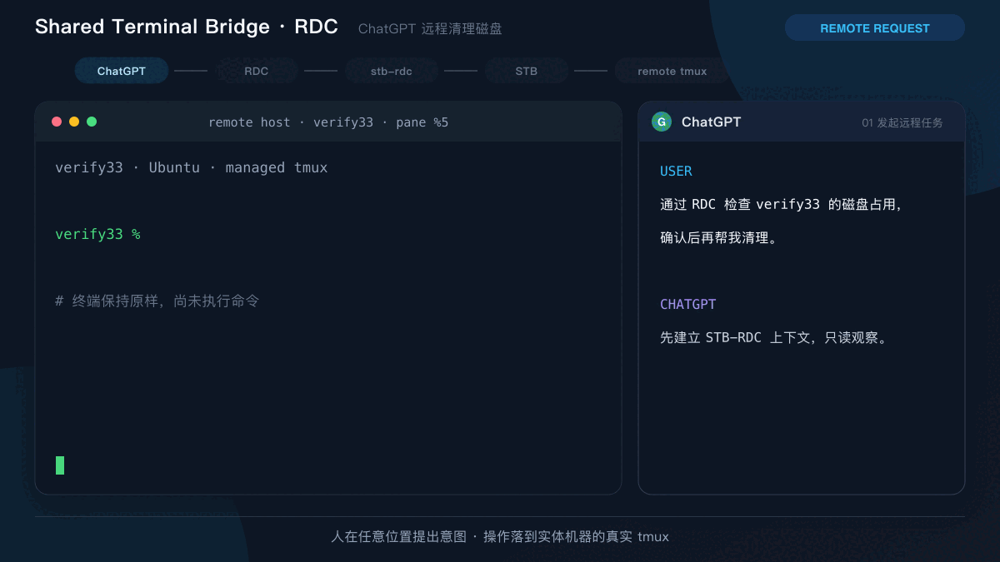
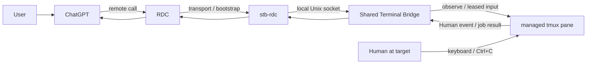

# Shared Terminal Bridge — RDC Adapter

> **项目导航** · [Shared Terminal Bridge](https://github.com/sharpbai/shared-terminal-bridge)（核心 Bridge） · **[STB-RDC](https://github.com/sharpbai/shared-terminal-bridge-rdc)**（ChatGPT/RDC 远程适配器） · [系列文档](https://github.com/sharpbai/shared-terminal-bridge-docs)（设计与演进记录）

让 ChatGPT 可以从任意环境触达实体机器，同时保留 Shared Terminal Bridge 的共享上下文、显式授权、Human Override 和本地审计边界。

STB-RDC 是 Remote Desktop Commander（RDC）到 [Shared Terminal Bridge](https://github.com/sharpbai/shared-terminal-bridge) 的薄适配层。RDC 负责找到设备并建立远程调用通道；真正的终端观察和执行仍通过目标机器上的 STB 与 tmux 完成。



上面的演示以远程磁盘清理为例：ChatGPT 通过 RDC 连接实体机器，使用 `stb-rdc` 发现 `verify33` 托管会话；STB 先提供只读上下文，人工批准后才授予 execution lease。命令在远程 tmux pane 中可见执行，长任务由目标机器本地等待，结果或 Human Override 再沿 RDC 返回 ChatGPT。

## 为什么需要 STB-RDC

Codex 适合在一台本地机器上使用项目、终端和文件系统，但 ChatGPT 的价值在于可以从更多环境发起任务、共享会话上下文，并成为统一的交互入口。对于运维和 IT 支持，仅有远程 Shell 还不够：

- 用户希望从任意设备向 ChatGPT 描述意图，再由它操作真正承担工作的机器。
- 运维状态存在于持续运行的 SSH、Shell 和 tmux 中，不能每次远程调用都重新建立上下文。
- 人可能正在实体机器前操作，需要与远程 Agent 看见同一个终端并随时接管。
- RDC 同时可能提供 filesystem、process、shell 等能力；如果随意混用，会绕过 STB 的 ACL、lease、generation 和审计链路。
- 长任务不应要求 ChatGPT 持续轮询远端，也不能因为一次 transport wait 超时就错误中断目标进程。
- 人按下 `Ctrl+C` 后，已经排队或等待中的旧模型决策必须在到达 pane 前失效。

STB-RDC 的重点不是再造远程终端，而是把 ChatGPT 的远程可达性与 STB 已验证的本地安全语义组合起来。

## 它解决什么问题

| 痛点 | STB-RDC 的处理方式 |
| --- | --- |
| ChatGPT 无法直接使用本地 STB socket | RDC 提供设备发现和远程 transport |
| 远程调用容易创建另一份隐藏 Shell | Adapter 始终绑定现有 STB 托管 tmux session |
| RDC 原生能力可能绕过 STB | Exclusive Mode 将目标主机操作收敛到 STB capability plane |
| 每次调用都重复传输完整终端 | `bootstrap/context` 返回有界上下文 |
| 写入权限生命周期不清晰 | `lease → send → job/wait`，每次写入校验 generation |
| 远程长任务导致反复轮询 | Bridge 在目标机器本地等待，状态变化才返回 |
| 人工中断后旧任务继续 | Human `Ctrl+C` 撤销 lease，旧 generation 被强制拒绝 |
| Transport 超时被当成命令失败 | wait timeout 只结束观察窗口，不改变 job 状态 |

## 工作方式



唯一的正式终端执行路径是：

```text
ChatGPT → RDC → stb-rdc → STB → tmux
```

职责边界：

1. **ChatGPT**：理解意图、制定计划、展示命令并解释结果。
2. **RDC**：发现设备、启动或调用 Adapter、传输结构化输入输出。
3. **stb-rdc**：把远程请求映射到稳定的 STB API，并声明交互策略。
4. **STB**：强制 Pane ACL、execution lease、generation、job/wait 和 Human Override。
5. **tmux**：保存双方共享的真实 Shell、终端历史和人工输入。

更完整的信任边界和状态流转见[架构说明](docs/architecture.md)。

## 快速开始

### 1. 前置条件

目标机器需要：

- Python 3
- 已运行的 Shared Terminal Bridge daemon
- 至少一个 STB 托管 tmux session
- RDC 能够调用目标机器上的 `stb-rdc`

Adapter 没有第三方 Python 依赖，通过 STB 默认 Unix socket 工作。

### 2. 检查连接

```bash
python3 ./stb-rdc status
```

返回 Adapter、Bridge、托管 session 和 Interaction Policy 后，说明远程链路已经可用。

### 3. Bootstrap 托管会话

```bash
python3 ./stb-rdc bootstrap verify33 --lines 40
```

`bootstrap` 只做 discovery：返回 session、pane、终端状态、有界上下文和执行策略，不执行用户任务，也不取得 lease。

### 4. 观察和执行

```bash
python3 ./stb-rdc context verify33 --lines 40
python3 ./stb-rdc lease verify33
python3 ./stb-rdc send verify33 7 'df -h /'
python3 ./stb-rdc wait JOB_ID --seconds 60
```

其中 `7` 只是示例，必须使用本次 `lease` 实际返回的 generation。`send` 返回的 `job_id` 用于后续 `job` 或 `wait`，不得从历史记录复用 generation。

完整的准备、命令说明和故障排查见[快速上手](docs/getting-started.md)。

## Exclusive Mode

当用户明确要求使用 STB-RDC 时，RDC 只承担 transport/bootstrap。目标主机上的读取、命令执行、文件操作和状态检查都应通过 STB 路径完成。

RDC 自身独立提供的 filesystem、directory、search、process、shell 和 edit 等能力默认属于 bypass。STB 能力不足时必须 fail closed，向人工说明缺失能力、精确操作和影响范围；只有取得一次性、capability-scoped 的明确批准后才能旁路。

旁路永远不能用于绕过：

- Human `Ctrl+C`
- 已撤销或失效的 execution lease
- stale generation
- Pane ACL
- 长任务人工批准

目前 Adapter 和模型策略能够约束 STB-RDC 自身的调用路径；要从物理上隐藏 RDC 的其他工具，还需要宿主支持 capability filtering 或 policy hook。不要把提示词约束描述成完整的硬隔离。

## Human Override 与长任务

STB-RDC 复用 STB 的语义：

```text
Human Ctrl+C ≠ remote call failed
Human Ctrl+C ≠ retry
Human Ctrl+C = revoke the current Agent execution authority
```

人按下 `Ctrl+C` 后，当前 job 返回 `INTERRUPTED_BY_HUMAN`，lease 变为 `REVOKED`，旧 generation 的后续 `send` 会在进入 pane 前返回 `EXECUTION_LEASE_INVALID`。当前 ChatGPT 回合必须停止；只有新的用户意图才能开始新的授权周期。

对于长任务，使用 `send → job_id → wait`。一次 `wait` 超时只表示当前观察窗口结束，不表示命令失败，也不授权自动发送 `Ctrl+C`。可以重新读取 job 状态，或在有可信进展时继续等待。

## 安全与协作原则

- **RDC is transport**：远程连接能力不等于目标主机执行权限。
- **Bootstrap is discovery only**：冷启动先发现状态，不把“连接成功”解释为任务授权。
- **STB is the enforcement point**：关键安全判断由目标机器本地完成。
- **Read before write**：先用有界上下文确认环境，再展示命令并申请 lease。
- **Visible execution**：命令进入人能看到的共享 tmux pane，不创建隐藏 Shell。
- **Generation-bound authority**：旧回合、旧请求和并发晚到写入不能复用授权。
- **Human first**：目标机器前的人始终可以直接接管。
- **Bounded remote context**：只跨 RDC 返回当前判断所需的输出和证据。

## 文档

- [快速上手与命令参考](docs/getting-started.md)
- [架构与信任边界](docs/architecture.md)
- [验证与回归索引](docs/validation-index.md)
- [v0.1 端到端验收记录](VALIDATION-v0.1.md)
- [版本变化](CHANGELOG.md)
- [上游 Shared Terminal Bridge](https://github.com/sharpbai/shared-terminal-bridge)

## 当前状态

当前版本为 `0.2.3`，已经在 ChatGPT + RDC + STB + `verify33` 的真实链路上验证：正常提交、job/wait、人工 `Ctrl+C`、lease revoke、stale generation 拒绝，以及 blocking wait 被 Human Event 唤醒。

STB-RDC 仍是薄 Adapter：它不复制 STB 的 Human Event Layer，不实现独立 lease，也不直接操作 tmux。后续演进应继续优先增强宿主 capability filtering、结构化错误和更稳定的远程工具协议，而不是把安全逻辑搬到 Adapter 中。
